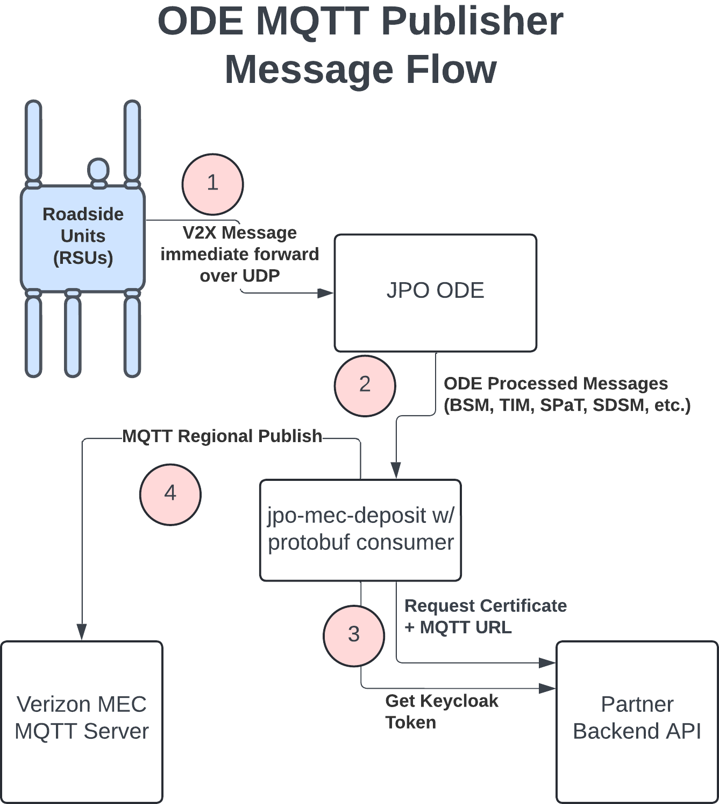
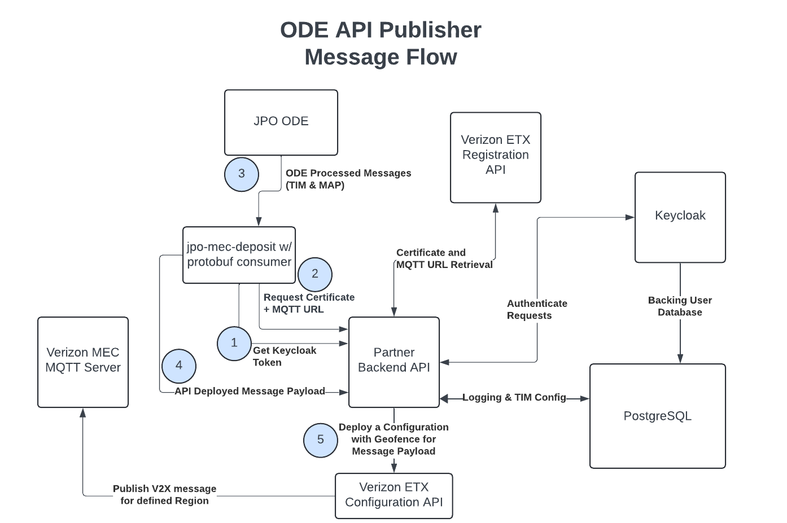
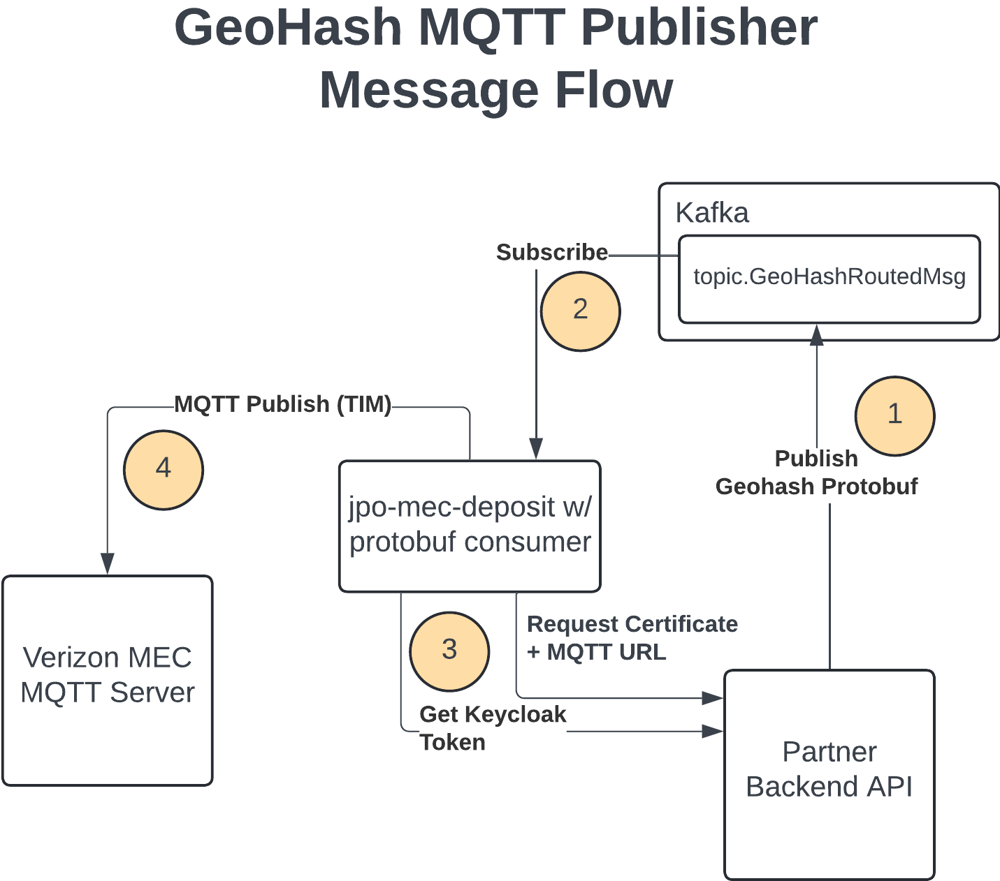
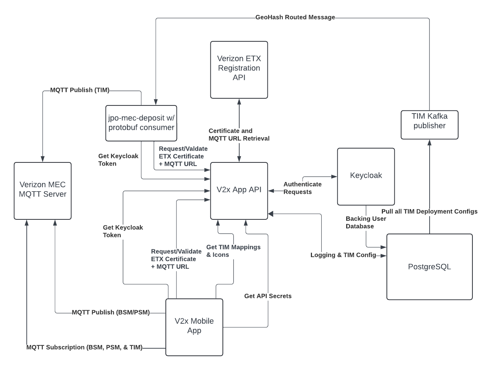

# jpo-mec-deposit

This project is intended to serve as a consumer application to subscribe to a Kafka topic of streaming JSON from the [ODE](https://github.com/usdot-jpo-ode/jpo-ode) and stream this data to MQTT based Mobile Edge Compute (MEC) datacenters depending on the provided configuration to allow for network based V2X integrations. This runs alongside the ODE and when deployed using Docker Compose, runs in a Docker container.

## Table of Contents

- [jpo-mec-deposit](#jpo-mec-deposit)
  - [Table of Contents](#table-of-contents)
  - [Release Notes](#release-notes)
  - [Usage](#usage)
    - [Run with Docker](#run-with-docker)
    - [Docker Compose Files](#docker-compose-files)
    - [Run with Vscode](#run-with-vscode)
      - [Launch Configurations](#launch-configurations)
        - [Generate GitHub Token](#generate-github-token)
  - [Configuration](#configuration)
    - [ETX MEC Deposit](#etx-mec-deposit)
      - [ETX MQTT Deposit](#etx-mqtt-deposit)
      - [ETX API Deposit](#etx-api-deposit)
    - [Confluent Cloud Integration](#confluent-cloud-integration)
      - [Environment variables](#environment-variables)
        - [Purpose \& Usage](#purpose--usage)
        - [Note](#note)
  - [Message Flow Diagrams](#message-flow-diagrams)
    - [ODE MQTT Publisher Message Flow](#ode-mqtt-publisher-message-flow)
    - [ODE API Publisher Message Flow](#ode-api-publisher-message-flow)
    - [GeoHash MQTT Publisher Message Flow](#geohash-mqtt-publisher-message-flow)
    - [V2X App API Integration](#v2x-app-api-integration)
  - [GeoHash MQTT Publisher](#geohash-mqtt-publisher)
    - [Overview](#overview)
    - [Architecture](#architecture)
    - [Message Processing Flow](#message-processing-flow)
    - [Publisher Configuration](#publisher-configuration)
  - [Development Setup](#development-setup)
    - [Integrated Development Environment (IDE)](#integrated-development-environment-ide)
    - [Dev Container Environment](#dev-container-environment)
    - [Checkstyle configuration](#checkstyle-configuration)
  - [Testing](#testing)
    - [Unit Tests](#unit-tests)

<!--
#############################################
############# Release Notes #############
#############################################
 -->

<a name="release-notes"></a>

## Release Notes

The current version and release history of the jpo-mec-deposit: [jpo-mec-deposit Release Notes](docs/Release_notes.md)

[Back to top](#table-of-contents)

<!--
#############################################
############# Usage #############
#############################################
 -->

<a name="usage"></a>

## Usage

### Run with Docker

1. Create a copy of `sample.env` and rename it to `.env`.
2. Create a copy of `jpo-utils/sample.env` and rename it to `.env` in the `jpo-utils` directory.
3. Update the variable `DOCKER_HOST_IP` to the local IP address of the system running docker in the `.env` file.
4. Generate GitHub Token
   1. Log into GitHub.
   2. Navigate to Settings -> Developer settings -> Personal access tokens.
   3. Click "New personal access token (classic)".
      1. As of now, GitHub does not support `Fine-grained tokens` for obtaining packages.
   4. Provide a name and expiration for the token.
   5. Select the `read:packages` scope.
   6. Click "Generate token" and copy the token.
   7. Copy the token name and token value into your `.env` file.
5. Run the following command to start the Docker Compose services: `docker compose up -d`

### Docker Compose Files

The following docker compose files are provided to help with development:

1. `docker-compose.yml` file can be used to spin up the depositor as a container.
2. `docker-compose-ode.yml` file can be used to spin up the depositor as a container along with the ODE.
3. `jpo-utils/docker-compose.yml` file can be used to spin up infrastructure services (kafka, mongo, etc.). Please refer to the [jpo-utils README](./jpo-utils/README.md) for more information.

To vary which services are started, use the `COMPOSE_PROFILES` environment variable. This project has a few profiles defined in the [sample.env](./sample.env) file. For further profiles from JPO Utils please refer to the [jpo-utils README](./jpo-utils/README.md) and [sample.env](./jpo-utils/sample.env).

### Run with Vscode

#### Launch Configurations

A launch.json file with some launch configurations have been included to allow developers to debug the project in VSCode. Please make sure your `.env` file is already created and populated with the correct values. Also, make sure to run docker compose up -d before running the launch configuration. Also add the following local configuration to allow for retrieval of GitHub hosted JAR files:

##### Generate GitHub Token

A GitHub token is required to pull artifacts from GitHub repositories. This is required to obtain the jpo-ode jars and must be done before attempting to build this repository.

1. Log into GitHub.
2. Navigate to Settings -> Developer settings -> Personal access tokens.
3. Click "New personal access token (classic)".
   1. As of now, GitHub does not support `Fine-grained tokens` for obtaining packages.
4. Provide a name and expiration for the token.
5. Select the `read:packages` scope.
6. Click "Generate token" and copy the token.
7. Copy the token name and token value into your `.env` file.
8. Create a copy of [settings.xml](jpo-mec-deposit/settings.xml) and save it to `~/.m2/settings.xml`
9. Update the variables in your `~/.m2/settings.xml` with the token value and target jpo-ode organization. Here is an example filled in `settings.xml` file:

```XML
<?xml version="1.0" encoding="UTF-8"?>
<settings>
    <activeProfiles>
        <activeProfile>default</activeProfile>
    </activeProfiles>
    <servers>
        <server>
            <id>github</id>
            <username>jpo_mec_deposit</username>
            <password>ghp_token-string-value</password>
        </server>
    </servers>
    <profiles>
        <profile>
            <id>default</id>
            <repositories>
                <repository>
                    <id>github</id>
                    <name>GitHub Apache Maven Packages</name>
                    <url>https://maven.pkg.github.com/usdot-jpo-ode/jpo-ode</url>
                    <snapshots>
                        <enabled>false</enabled>
                    </snapshots>
                </repository>
            </repositories>
        </profile>
    </profiles>
</settings>
```

To run the project through the launch configuration and start debugging, the developer can navigate to the Run panel (View->Run or Ctrl+Shift+D), select the configuration at the top, and click the green arrow or press F5 to begin.

[Back to top](#table-of-contents)

<!--
#############################################
############# Configuration #############
#############################################
 -->

<a name="configuration"></a>

## Configuration

### ETX MEC Deposit

The ETX MEC Deposit is a feature that allows the depositor to deposit messages to an ETX MEC. This is done by setting the `ETX_ENABLED` environment variable to `True` and providing the necessary ETX configuration. Please refer to the [sample.env](./sample.env) file for the necessary environment variables.

#### ETX MQTT Deposit

The ETX MQTT Deposit is a feature that allows the depositor to deposit messages to an ETX MQTT broker. This is done by setting the `ETX_MQTT_ENABLED` environment variable to `True` and providing the necessary ETX MQTT configuration. Please refer to the [sample.env](./sample.env) file for the necessary environment variables.

Regional JSON depositors consume ODE topics such as BSM (`topic.OdeBsmJson`), PSM (`topic.OdePsmJson`), SPAT, TIM, MAP, and SDSM, and can fan out to **ETX**, **NMI**, and **AV** when those brokers are enabled. Shared defaults use `DEPOSITORS_*` keys (for example `DEPOSITORS_PSM_MQTT_ENABLED` and `DEPOSITORS_PSM_MQTT_KAFKA_TOPIC`); optional per-broker overrides follow the `ETX_MQTT_BROKERS_ETX_DEPOSITORS_*`, `NMI_MQTT_BROKERS_NMI_DEPOSITORS_*`, and `AV_MQTT_BROKERS_AV_DEPOSITORS_*` patterns. The [docker-compose.yml](./docker-compose.yml) `mec-deposit` service passes these variables through to the container environment.

When `ETX_MQTT_MESSAGE_FORMAT` is `j2735_gr`, **ETX** receives a `GeoRoutedMsg` protobuf for regional depositors; **NMI** and **AV** still receive the **raw** ASN.1 bytes from the ODE metadata (same split as the geohash publisher for NMI/AV).

For TrafficAuth/NMI MQTT publishing, use non-TLS MQTT and disable ETX registration-based connection:

- `ETX_MQTT_BROKER_TYPE="NMI"`
- `ETX_MQTT_USE_TLS="False"`
- `ETX_MQTT_USE_REGISTRATION="False"`
- `ETX_MQTT_REQUIRE_SESSION_ID="False"`
- `ETX_MQTT_BROKER_URI="mqtt://mqtt.development.v2x.isscms.com:1883"` (test) or production URI

When using the geohash MQTT depositor with `ETX_MQTT_BROKER_TYPE="NMI"`, topics follow the NMI topic structure: `v1/g32/{g1}/{g2}/{g3}/{g4}/{g5}/{g6}/{g7}/{dsrcMsgID}` and publish the original signed payload bytes (signature preserved) instead of ETX wrapped payload definitions. The same `v1/g32/...` pattern is used when publishing to the AV MQTT broker.

To publish to ETX, NMI, and AV in the same application instance, enable multi-broker fanout:

- `ETX_MQTT_MULTI_BROKER_ENABLED="True"`
- `ETX_MQTT_MULTI_BROKER_TARGETS="ETX,NMI,AV"` (or a subset such as `ETX,NMI`)
- `NMI_MQTT_ENABLED="True"` when including NMI
- `AV_MQTT_ENABLED="True"` when including AV

### ETX + NMI deployment profile templates

Two deployment profile templates are included:

- ETX-only deployment: [`.env.etx.example`](./.env.etx.example)
- NMI-only deployment: [`.env.nmi.example`](./.env.nmi.example)

AV (and dual or triple publish) uses the same `mec-deposit.etx.mqtt-brokers.*` property keys as in [sample.env](./sample.env); there is no separate `.env.av.example` in this repository.

Use distinct consumer groups per deployment (for example, `jpo-mec-deposit-etx` and `jpo-mec-deposit-nmi`) with `KAFKA_CONSUMER_GROUP_ID`.

### Broker-Scoped Observability

Multi-broker mode records broker-tagged publish counters:

- `mec-deposit.mqtt.publish{broker="etx|nmi|av",outcome="success|failure"}`
- `mec-deposit.nmi.mqtt.circuit.skipped` (NMI circuit-breaker skips)

Recommended rollout guardrails:

- Canary enable dual mode on a single instance first.
- Alert if NMI failure counter exceeds ETX success over a 5-minute window.
- Roll back by setting `ETX_MQTT_MULTI_BROKER_ENABLED="False"` (or disable `NMI_MQTT_ENABLED` / `AV_MQTT_ENABLED`).

#### ETX API Deposit

The ETX API Deposit is a feature that allows the depositor to deposit messages to an ETX API. This is done by setting the `ETX_API_ENABLED` environment variable to `True` and providing the necessary ETX API configuration. Please refer to the [sample.env](./sample.env) file for the necessary environment variables.

### Confluent Cloud Integration

Rather than using a local kafka instance, this project can utilize an instance of kafka hosted by Confluent Cloud via SASL.

#### Environment variables

##### Purpose & Usage

- The `KAFKA_BOOTSTRAP_SERVERS` environment variable is used to communicate with the bootstrap server that the instance of Kafka is running on.
- The `SPRING_PROFILES_ACTIVE` environment variable specifies what type of kafka connection will be attempted and is used to check if Confluent should be utilized.
- The `CONFLUENT_KEY` and `CONFLUENT_SECRET` environment variables are used to authenticate with the bootstrap server.

##### Note

This has only been tested with Confluent Cloud but technically all SASL authenticated Kafka brokers can be reached using this method.

[Back to top](#table-of-contents)

<!--
#############################################
############# Message Flow Diagrams #############
#############################################
-->

<a name="message-flow-diagrams"></a>

## Message Flow Diagrams

The following diagrams illustrate the different message flow patterns supported by jpo-mec-deposit for publishing V2X messages to ETX MEC platforms.

### ODE MQTT Publisher Message Flow

The ODE MQTT Publisher flow handles direct publishing of ODE processed messages (BSM, PSM, TIM, SPaT, MAP, SDSM, etc.) to the Verizon MEC MQTT Server.



**Key Steps:**

1. **Get Keycloak Token**: The jpo-mec-deposit consumer requests a Keycloak token from the Partner Backend API for authentication.
2. **Request Certificate + MQTT URL**: The consumer requests the necessary certificate and MQTT URL from the Partner Backend API.
3. **ODE Processed Messages**: JPO ODE sends processed messages (BSM, PSM, TIM, SPaT, MAP, SDSM, etc.) to the jpo-mec-deposit Kafka consumers.
4. **MQTT Regional Publish**: The consumer publishes messages directly to the Verizon MEC MQTT Server using MQTT.

The Partner Backend API handles authentication with Keycloak, retrieves certificates and MQTT URLs from the Verizon ETX Registration API, and manages logging and TIM configuration in PostgreSQL.

### ODE API Publisher Message Flow

The ODE API Publisher flow handles publishing messages via the ETX Configuration API, allowing for geofence-based message deployment.



**Key Steps:**

1. **Get Keycloak Token**: The jpo-mec-deposit consumer requests a Keycloak token from the Partner Backend API.
2. **Request Certificate + MQTT URL**: The consumer requests certificate and MQTT URL from the Partner Backend API.
3. **ODE Processed Messages**: JPO ODE sends processed messages (TIM & MAP) to the jpo-mec-deposit protobuf consumer.
4. **API Deployed Message Payload**: The Partner Backend API deploys the message payload to the Verizon MEC MQTT Server.
5. **Deploy Configuration with Geofence**: The Partner Backend API deploys a configuration with geofence for the message payload to the Verizon ETX Configuration API.

This flow enables region-based message publishing through the Configuration API, which then publishes V2X messages for the defined region to the MQTT Server.

### GeoHash MQTT Publisher Message Flow

The GeoHash MQTT Publisher flow handles publishing V2X messages using geohash-based routing through Kafka and MQTT.



**Key Steps:**

1. **Get Keycloak Token**: The jpo-mec-deposit consumer requests a Keycloak token from the Partner Backend API.
2. **Request Certificate + MQTT URL**: The consumer requests certificate and MQTT URL from the Partner Backend API.
3. **Publishing V2X Messages**: V2X messages are published in `geoHashRoutedMsg` protobuf definitions to a Config Kafka publisher.
4. **MQTT Publish**: The consumer publishes to the configured MQTT broker targets (ETX and/or NMI/AV depending on multi-broker settings).

The Partner Backend API manages authentication, certificate retrieval, and interacts with PostgreSQL for logging, TIM configuration, and user database operations. PostgreSQL publishes TIM deployment configurations to the Config Kafka publisher, which feeds into the geohash routing system.

### V2X App API Integration

The V2X App API serves as the central application interface for authentication, registration, and data management in the V2X ecosystem. jpo-mec-deposit integrates with the V2X App API to obtain authentication tokens, ETX certificates, and MQTT connection details.



**Key Components:**

- **V2x App API**: Central hub that provides:
  - Authentication services via Keycloak integration
  - ETX certificate and MQTT URL retrieval from Verizon ETX Registration API
  - TIM mappings and configuration management
  - Logging and configuration storage in PostgreSQL

- **Integration Points with jpo-mec-deposit**:
  - **Get Keycloak Token**: jpo-mec-deposit requests authentication tokens from the V2X App API
  - **Request/Validate ETX Certificate + MQTT URL**: jpo-mec-deposit obtains necessary credentials and endpoint information for connecting to the Verizon MEC MQTT Server

- **Supporting Services**:
  - **Keycloak**: Identity and access management, authenticates requests from V2X App API
  - **PostgreSQL**: Stores logging data, TIM configuration, and serves as Keycloak's backing user database
  - **Verizon ETX Registration API**: Provides certificate and MQTT URL retrieval
  - **TIM Kafka Publisher**: Publishes geohash-routed messages consumed by jpo-mec-deposit

**Message Flow:**

The V2X App API orchestrates the authentication and registration flow:

1. jpo-mec-deposit requests a Keycloak token from the V2X App API
2. V2X App API authenticates with Keycloak (which uses PostgreSQL for user data)
3. jpo-mec-deposit requests ETX certificate and MQTT URL from the V2X App API
4. V2X App API retrieves credentials from the Verizon ETX Registration API
5. jpo-mec-deposit uses the obtained credentials to publish messages to the Verizon MEC MQTT Server

For more detailed information about the V2X App API, including setup, configuration, and API documentation, please refer to the [V2X App API GitHub repository](https://github.com/usdot-fhwa-stol/v2x-app-api).

[Back to top](#table-of-contents)

<!--
#############################################
############# GeoHash MQTT Publisher #############
#############################################
-->

<a name="geohash-mqtt-publisher"></a>

## GeoHash MQTT Publisher

### Overview

The GeoHash MQTT Publisher (`EtxGeohashMqttPublisher`) consumes `GeoHashRoutedMsg` protobuf messages from Kafka and publishes to MQTT. When **NMI** or **AV** targets are active, it publishes the **inner ASN.1 bytes** to NMI/AV topics (`v1/g32/...` with a DSRC message ID suffix). When **ETX** is active, it publishes an **ETX-specific wire form**: raw ASN.1 if `j2735`, or a serialized `GeoHashRoutedMsg` (timestamp + geohash + inner bytes) when the ETX MQTT message format is `j2735_gr`—matching the split used by regional JSON depositors (NMI/AV always receive raw bytes from the decoded frame).

### Architecture

The GeoHash MQTT Publisher operates as a Kafka consumer that:

- **Consumes**: `GeoHashRoutedMsg` protobuf messages from a configured Kafka topic
- **Extracts**: Original V2X message bytes and geohash from the protobuf
- **Publishes**: Fan-out to enabled MQTT broker targets with per-broker payloads and topics (ETX vs NMI/AV as described above)

**Key Components:**

- **GeoHashRoutedMsg**: Input protobuf message containing:
  - Original message bytes (ASN.1 encoded V2X message)
  - Timestamp
  - Geohash string (base32 encoded geographic identifier)

- **ETX `j2735_gr` wire payload**: Serialized `GeoHashRoutedMsg` built from those inner bytes, the consumption timestamp, and the geohash (ETX only when configured).

### Message Processing Flow

1. **Kafka Consumption**: The publisher listens to the configured Kafka topic (default: `topic.GeoHashRoutedMsg`) using a byte array consumer.

2. **Message Parsing**:
   - Parses the incoming `GeoHashRoutedMsg` protobuf message
   - Extracts the original message bytes and geohash string

3. **Geohash Processing**:
   - Converts the geohash string to a `GeoHash` object
   - Extracts latitude and longitude coordinates from the geohash originating point

4. **Message Type Detection**:
   - Analyzes the original message bytes to detect the V2X message type (BSM, PSM, TIM, SPaT, MAP, SDSM, etc.)
   - Defaults to TIM if detection fails

5. **Topic Generation**:
   - Builds MQTT topic using the geohash, detected message type, and configuration properties
   - Topic structure includes: namespace (REGIONAL or REGIONAL_STATIC), geohash path, message type, vendor, client type/subtype, and message format
   - Uses geohash directly to avoid redundant coordinate conversions

6. **Per-broker payload and publish**:
   - Computes NMI/AV topics under `v1/g32/...` and publishes **raw** message bytes to those brokers when enabled
   - Computes the ETX topic and publishes the **ETX wire payload** (raw or `GeoHashRoutedMsg` per `j2735` / `j2735_gr`) when ETX is enabled

7. **Metrics & Logging**:
   - Records processing success/failure metrics
   - Logs debug information including topic, message type, and geohash

### Publisher Configuration

The GeoHash MQTT Publisher is enabled by setting the following environment variables:

```bash
# Enable ETX functionality
ETX_ENABLED="True"

# Enable GeoHash MQTT Publisher
DEPOSITORS_GEOHASH_MQTT_ENABLED="True"

# Kafka topic for GeoHashRoutedMsg messages
DEPOSITORS_GEOHASH_MQTT_KAFKA_TOPIC="topic.GeoHashRoutedMsg"
```

**Additional Configuration Properties:**

- `mec-deposit.etx.mqtt.precision`: Geohash precision (default: 7, range: 6-8)
- `mec-deposit.etx.mqtt.vendor`: Vendor identifier for MQTT topics
- `mec-deposit.etx.mqtt.message-format`: Message format for the ETX leg (`j2735` raw ASN.1 on the wire, or `j2735_gr` to wrap in `GeoRoutedMsg` / `GeoHashRoutedMsg` as above)
- `mec-deposit.etx.client-type`: Client type (e.g., "Software")
- `mec-deposit.etx.client-sub-type`: Client subtype (e.g., "Application")

**Conditional Activation:**

The publisher bean is created when geohash MQTT is enabled on **at least one** of the ETX, NMI, or AV broker profiles (`mec-deposit.etx.mqtt-brokers.*.depositors.geohash.mqtt.enabled`, bound from `DEPOSITORS_GEOHASH_MQTT_ENABLED` and optional per-broker overrides). Publishing to a given broker still requires that broker’s client to be configured and enabled (for example ETX registration/TLS settings for ETX, or `NMI_MQTT_ENABLED` / `AV_MQTT_ENABLED` for those targets).

**Kafka Consumer Group:**

The publisher uses a dedicated consumer group: `${spring.kafka.consumer.group-id}-geohash-mqtt-publisher`

This ensures that geohash messages are processed independently from other message types and allows for separate scaling and monitoring.

[Back to top](#table-of-contents)

<!--
#############################################
############# Development Setup #############
#############################################
-->

<a name="development-setup"></a>

## Development Setup

### Integrated Development Environment (IDE)

Install the IDE of your choice:

- VSCode (Recommended): [https://code.visualstudio.com/](https://code.visualstudio.com/)
- Eclipse: [https://eclipse.org/](https://eclipse.org/)
- STS: [https://spring.io/tools/sts/all](https://spring.io/tools/sts/all)
- IntelliJ: [https://www.jetbrains.com/idea/](https://www.jetbrains.com/idea/)

### Dev Container Environment

The project can be reopened inside a dev container in VSCode. This environment should have all the necessary dependencies to debug the ODE and its submodules. When attempting to run scripts in this environment, it may be necessary to make them executable with "chmod +x" first.

### Checkstyle configuration

This project uses [Checkstyle](https://github.com/checkstyle/checkstyle) with a modified version
of Google's Java Style guide to weakly enforce style standards. To configure Checkstyle with your
chosen IDE follow one of the following guides. This repo's checkstyle configuration file can be found
[here](checkstyle.xml). For a quick guide to Checkstyle, check out this short [article](https://www.baeldung.com/checkstyle-java).

- [Intellij](https://plugins.jetbrains.com/plugin/1065-checkstyle-idea)
- [VSCode](https://code.visualstudio.com/docs/java/java-linting#_checkstyle)
- [Eclipse](https://checkstyle.org/eclipse-cs/#!/project-setup)

If you prefer the command line for your checkstyle output. You can run `mvn checkstyle:check` to
check the whole project. See [Checkstyle's Github](https://github.com/checkstyle/checkstyle) for more info.

[Back to top](#table-of-contents)

## Testing

### Unit Tests

To run the unit tests, reopen the project in the provided dev container and run the following command:

```bash
cd jpo-mec-deposit
mvn test
```

This will run the unit tests and provide a report of the results.
